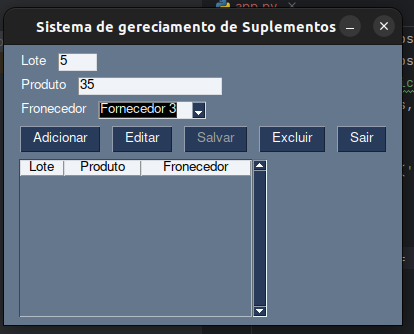

# Documentação do Sistema de Gerenciamento de Suplementos

Visão Geral

O Sistema de Gerenciamento de Suplementos é uma aplicação desenvolvida em Python utilizando a biblioteca PySimpleGUI. Essa aplicação permite adicionar e gerenciar fornecedores de suplementos. Ela foi projetada para fornecer uma interface gráfica simples e intuitiva para facilitar o controle e o acesso às informações dos fornecedores. 

# Trabalho da Faculdade.
 
 